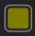
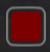

# SM_SmartChests

Scrap Mechanic mod for smarter pipe inventory routing.

## What this mod changes

Vanilla/old `FindContainerToCollectTo` behavior sends items to the **first** connected container that can accept them.

SM_SmartChests changes this to **priority-based routing**:
- scan all valid connected containers,
- score each container by rules,
- send the item to the highest-priority match.

`Crafter.lua` is also patched so crafter outputs use the same priority logic.

## Installation

Back up original files first, then replace both files:

1. Replace:
   - `...\Scrap Mechanic\Survival\Scripts\game\util\pipes.lua`
   - with this repo's `pipes.lua`
2. Replace:
   - `...\Scrap Mechanic\Survival\Scripts\game\interactables\Crafter.lua`
   - with this repo's `Crafter.lua`
3. Start the game.

## Paint colors: exact meaning in this mod

Palette reference (top = lightest row, bottom = darkest row):

### Single-item chest colors (priority 3)

These 20 swatches make a chest single-item filtered:

- Lightest row:
           
- Darkest row:
           

Behavior:
- If slot 1 already has an item, only that item is accepted.
- If empty, first inserted item defines what it will accept afterward.

### Category chest colors (priority 2)

Use these swatches for category filtering:

-  = Metal category
-  = Wood category
-  = Stone/Glass/Tiles category
-  = Carpet/Plastic/Bubblewrap category
-  = Pipes/Fittings category
-  = Vehicle parts category
-  = Logic parts category

Note: the Pale Blue swatch is also in the single-item color list, and single-item priority is higher; if you use that exact swatch, single-item behavior wins first.

## Priority order in-game

When collecting items through pipes/crafters:

1. **Dedicated/special containers** (priority 4)
2. **Single-item painted chests** (priority 3)
3. **Category-painted chests** (priority 2)
4. **All other chests** (priority 1)

## Dedicated/special container mappings (priority 4)

- `obj_consumable_gas` -> `obj_container_gas`
- `obj_consumable_battery` -> `obj_container_battery`
- `obj_consumable_chemical` -> `obj_container_chemical`
- `obj_consumable_water` -> `obj_container_water`
- `obj_plantables_potato` -> `obj_container_ammo`
- `obj_consumable_fertilizer` -> `obj_container_fertilizer`

## Full category lists (exact values from `pipes.lua`)

###  Metal
- `blk_metal1`
- `blk_metal2`
- `blk_metal3`
- `blk_scrapmetal`
- `blk_beam`
- `blk_crossnet`
- `blk_tryponet`
- `blk_metalnet`
- `blk_spaceshipmetal`
- `blk_lights`

###  Wood
- `blk_cardboard`
- `blk_wood1`
- `blk_wood2`
- `blk_wood3`
- `blk_scrapwood`
- `blk_caution`

###  Stone/Glass/Tiles
- `blk_sand`
- `blk_concrete1`
- `blk_concrete2`
- `blk_concrete3`
- `blk_scrapstone`
- `blk_bricks`
- `blk_glass`
- `blk_armoredglass`
- `blk_glasstile`
- `blk_tiles`

###  Carpet/Plastic/Bubblewrap
- `blk_carpet`
- `blk_plastic`
- `blk_bubblewrap`

###  Pipes/Fittings
- `small_2way_pipe`
- `small_2wayb_pipe`
- `small_3way_pipe`
- `small_3wayb_pipe`
- `small_4way_pipe`
- `small_4wayb_pipe`
- `small_5way_pipe`
- `small_6way_pipe`
- `small_long_pipe`
- `obj_fittings_pipe`
- `obj_fittings_pipebend`
- `obj_fittings_pipesplit`
- `obj_fittings_pipelong`
- `obj_fittings_pipevalve`

###  Vehicle parts
- `obj_interactive_driversaddle_01`
- `obj_interactive_driversaddle_02`
- `obj_interactive_driversaddle_03`
- `obj_interactive_driversaddle_04`
- `obj_interactive_driversaddle_05`
- `obj_interactive_driverseat_01`
- `obj_interactive_driverseat_02`
- `obj_interactive_driverseat_03`
- `obj_interactive_driverseat_04`
- `obj_interactive_driverseat_05`
- `obj_interactive_seat_01`
- `obj_interactive_seat_02`
- `obj_interactive_seat_03`
- `obj_interactive_seat_04`
- `obj_interactive_seat_05`
- `obj_interactive_saddle_01`
- `obj_interactive_saddle_02`
- `obj_interactive_saddle_03`
- `obj_interactive_saddle_04`
- `obj_interactive_saddle_05`
- `obj_interactive_gasengine_01`
- `obj_interactive_gasengine_02`
- `obj_interactive_gasengine_03`
- `obj_interactive_gasengine_04`
- `obj_interactive_gasengine_05`
- `obj_interactive_electricengine_01`
- `obj_interactive_electricengine_02`
- `obj_interactive_electricengine_03`
- `obj_interactive_electricengine_04`
- `obj_interactive_electricengine_05`
- `obj_interactive_thruster_01`
- `obj_interactive_thruster_02`
- `obj_interactive_thruster_03`
- `obj_interactive_thruster_04`
- `obj_interactive_thruster_05`
- `jnt_suspensionoffroad_01`
- `jnt_suspensionoffroad_02`
- `jnt_suspensionoffroad_03`
- `jnt_suspensionoffroad_04`
- `jnt_suspensionoffroad_05`
- `jnt_suspensionsport_01`
- `jnt_suspensionsport_02`
- `jnt_suspensionsport_03`
- `jnt_suspensionsport_04`
- `jnt_suspensionsport_05`
- `jnt_interactive_piston_01`
- `jnt_interactive_piston_02`
- `jnt_interactive_piston_03`
- `jnt_interactive_piston_04`
- `jnt_interactive_piston_05`
- `obj_interactive_mountablespudgun`
- `jnt_bearing`
- `obj_vehicle_smallwheel`
- `obj_vehicle_bigwheel`

###  Logic parts
- `obj_interactive_controller_01`
- `obj_interactive_controller_02`
- `obj_interactive_controller_03`
- `obj_interactive_controller_04`
- `obj_interactive_controller_05`
- `jnt_interactive_piston_01`
- `jnt_interactive_piston_02`
- `jnt_interactive_piston_03`
- `jnt_interactive_piston_04`
- `jnt_interactive_piston_05`
- `obj_interactive_sensor_01`
- `obj_interactive_sensor_02`
- `obj_interactive_sensor_03`
- `obj_interactive_sensor_04`
- `obj_interactive_sensor_05`
- `obj_interactive_switch`
- `obj_interactive_button`
- `obj_interactive_logicgate`
- `obj_interactive_timer`
