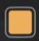
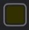
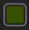
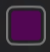
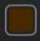

# SM_SmartChests

Scrap Mechanic mod for smarter pipe inventory routing.

## What this mod changes

Vanilla/old `FindContainerToCollectTo` behavior sends items to the **first** connected container that can accept them.

SM_SmartChests changes this to **priority-based routing**:
- scan all valid connected containers,
- score each container by rules,
- send the item to the highest-priority match.

`Crafter.lua` and `Vacuum.lua` are also patched so crafter outputs and the vacuum tool use the same priority logic — all collection in the mod routes through a single shared function, `GetSmartCollectContainer`, in `pipes.lua`.

## Installation

Back up original files first, then replace all three files:

1. Replace:
   - `...\Scrap Mechanic\Survival\Scripts\game\util\pipes.lua`
   - with this repo's `pipes.lua`
2. Replace:
   - `...\Scrap Mechanic\Survival\Scripts\game\interactables\Crafter.lua`
   - with this repo's `Crafter.lua`
3. Replace:
   - `...\Scrap Mechanic\Survival\Scripts\game\items\Vacuum.lua`
   - with this repo's `Vacuum.lua`
4. Start the game.

## Paint colors: exact meaning in this mod

Palette reference (top = lightest row, bottom = darkest row):

**Note:** earlier versions of this mod turned the 20 lightest/darkest swatches —                     — into a "single-item" filter: whichever item was inserted first became the only item that chest would accept. **That mechanic has been removed.** All 40 swatches in the palette are now ordinary category colors (see the full list below), so a chest's behavior is predictable from its paint alone instead of depending on insertion order.

### Category chest colors (priority 2)

Paint a chest with any of the swatches below to restrict it to that category. Matching is done by exact paint hex value (including alpha, e.g. `4a4a4aff`).

 Pale Orange (`eeaf5cff`) is reserved and currently unused (freed up when `scrap.json` was merged into the vehicle parts category) — painting a chest with it has no special filtering effect. Every other one of the 40 palette swatches now maps to a category.

## Priority order in-game

When collecting items through pipes/crafters/the vacuum:

1. **Dedicated/special containers** (priority 4) — always wins, regardless of paint color.
2. **Category-painted chests** (priority 2) — item must be in the category matching the chest's paint color.
3. **All other chests** (priority 1) — accepts anything.

(There is no priority 3 anymore — the old single-item-chest mechanic that used to occupy that tier has been removed.)

## Dedicated/special container mappings (priority 4)

- `obj_consumable_gas` -> `obj_container_gas`
- `obj_consumable_battery` -> `obj_container_battery`
- `obj_consumable_chemical` -> `obj_container_chemical`
- `obj_consumable_water` -> `obj_container_water`
- `obj_plantables_potato` -> `obj_container_ammo` (potatoes are spudgun ammo)
- `obj_consumable_fertilizer` -> `obj_container_fertilizer`
- all 12 `seeds.json` items -> `obj_container_seed`:
  - `obj_seed_banana`
  - `obj_seed_blueberry`
  - `obj_seed_orange`
  - `obj_seed_pineapple`
  - `obj_seed_carrot`
  - `obj_seed_redbeet`
  - `obj_seed_tomato`
  - `obj_seed_broccoli`
  - `obj_seed_potato`
  - `obj_seed_cotton`
  - `obj_seed_pigmentflower`
  - `obj_seed_chili`

## Full category lists (exact values from `pipes.lua`)

- `4a4a4aff` (Gray): **Metal blocks**
- `0e8031ff` (Dark Green): **Wood blocks**
- `817c00ff` (Dark Yellow): **Stone/Glass/Tiles blocks**
- `577d07ff` (Olive): **Plastic & Interior blocks**
- `d02525ff` (Dark Red): **Wedges (all materials)**
- `0f2e91ff` (Dark Blue): **Pipes**
- `1a75ffff` (Blue): **Electrical**
- `ffb400ff` (Yellow): **HVAC**
- `7c0000ff` (Dark Maroon): **Vehicle components**
- `673b00ff` (Brown): **Logic & electronics**
- `118787ff` (Cyan): **Industrial building**
- `7514edff` (Purple): **Containers**
- `720a74ff` (Dark Purple): **Craftbot components**
- `7f7f7fff` (Gray): **Tools**
- `e2db13ff` (Bright Yellow): **Power tools**
- `a0ea00ff` (Lime): **Robot parts**
- `2ce6e6ff` (Pale Cyan): **Appliances**
- `0a3ee2ff` (Dark Blue): **Building fixtures**
- `cf11d2ff` (Pink): **Survival/facility gear**
- `e7ac3fff` (Orange): **Packing station & warehouse logistics**
- `673b00ff` (Brown): **Logic & electronics**
- `84ff00ff` (Bright Green): **Food & farm items**
- `8d6b00ff` (Olive Brown): **Decor, signs & interactables**
- `af967bff` (Beige): **Office, furniture & home decor**
- `2ce6e6ff` (Pale Cyan): **Appliances**
- `1a75ffff` (Blue): **Electrical**
- `2c6ea6ff` (Blue Gray): **Warehouse blocks**
- `a04000ff` (Rust): **Warehouse props**
- `375000ff` (Dark Olive): **Farmbot and robot debris**
- `7514edff` (Purple): **Containers**
- `500aa6ff` (Deep Purple): **Harvestables, resources & special drops**
- `19e753ff` (Green): **Crafting resources & components**
- `504201ff` (Dark Brown): **Ammo, consumables & utility items**
- `8d6b00ff` (Olive Brown): **Decor, signs & interactables**
- `e84f0fff` (Orange Red): **Suspensions, pistons, bearings & mobility parts**
- `2ce6e6ff` (Pale Cyan): **Appliances**
- `0a3ee2ff` (Dark Blue): **Building fixtures**
- `118787ff` (Cyan): **Industrial building**
- `7c0000ff` (Dark Maroon): **Vehicle components**
- `eeaf5cff` (Pale Orange): **Reserved/unused**

(For an exact item-by-item mapping, see `catagoryContainer` in `/home/runner/work/SM_SmartChests/SM_SmartChests/pipes.lua`.)

